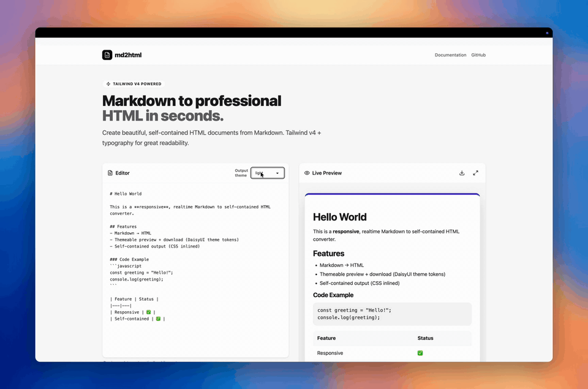

<h1 align="center">html2md 📝</h1>

<p align="center">
  Markdown → self-contained HTML with <strong>Pico-like classless styling</strong> powered by <strong>DaisyUI theme tokens</strong>.
</p>

<p align="center">
  <a href="https://github.com/4thel00z/html2md/actions/workflows/ci.yml">
    
  </a>
  <a href="https://www.npmjs.com/package/%404thel00z%2Fhtml2md">
    
  </a>
  <a href="LICENSE">
    
  </a>
</p>

## Requirements

- Bun (recommended for dev + demo)

## Install

```bash
bun install
```

## How to use (React component)

```bash
# In your React app
bun add @4thel00z/html2md
```

```tsx
import React from "react";
import { Converter } from "@4thel00z/html2md";

export function App() {
  return <Converter />;
}
```

## Demo video



## Template

- By default, `Converter` (and `render()`) uses an **embedded HTML template with inlined CSS** — **no routes/static files** are required.
- If you want to use a custom template, pass `templateUrl` (it will be fetched once and cached):

```tsx
<Converter templateUrl="/my-template.html" />
```

```ts
await render("# Hello", { theme: "night", templateUrl: "/my-template.html" });
```

## Library usage

```ts
import { render } from "@4thel00z/html2md";

const fullHtml = await render("# Hello", { theme: "night" });
```

## Demo app (local)

```bash
bun run start
```

## Contributing / Dev

```bash
bun install
bun run generate:template
bun run start
```

### Quality checks

```bash
bun run check
bun run format
```

### Enable pre-commit hooks (recommended)

```bash
bun run hooks:install
```

## LICENSE

This repo is MIT licensed.
